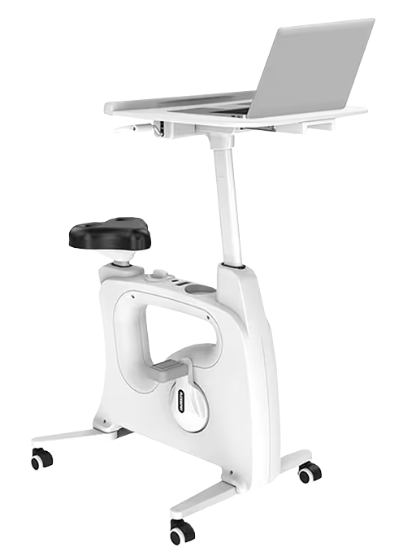

## Spinning
I have found that having a [Desk Bike](https://www.flexispot.com/all-in-one-desk-bikes-deskcise-pro) works really well for me. I've been working on my physical health and try to get at least an hour of cardio daily while playing some video games. [Deep Rock Galactic: Survivors](https://store.steampowered.com/app/2321470/Deep_Rock_Galactic_Survivor/), [Vampire Survivors](https://store.steampowered.com/app/1794680/Vampire_Survivors/),  and similar games are good matches.  With constant body movement, it is difficult to mouse click with precision. Thus, games that are designed for controllers should also work well.
