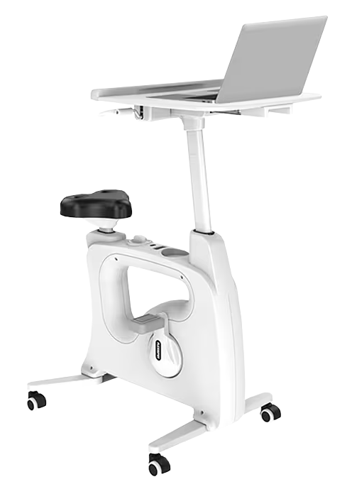

There is a saying that a person should have three types of hobbies in life. 
1. One to make you money
2. [One to keep you in shape](#shape)
3. [One to stay creative](#creative)

Let's talk about the latter two.

# One to keep you in shape 

I track my health with a smartwatch (e.g., Fitbit) and would recommend everyone to do so as well. Getting feedback about your own body greatly helps with living a healthy life.

## Spinning
I have found that having a [Desk Bike](https://www.flexispot.com/all-in-one-desk-bikes-deskcise-pro) works really well for me. I've been working on my physical health and try to get at least an hour of cardio daily while playing some video games. [Deep Rock Galactic: Survivors](https://store.steampowered.com/app/2321470/Deep_Rock_Galactic_Survivor/), [Vampire Survivors](https://store.steampowered.com/app/1794680/Vampire_Survivors/),  and similar games are good matches.  With constant body movement, it is difficult to mouse click with precision. Thus, games that are designed for controllers should also work well.

<!--

    
        
    



    
        
    

-->

## Hiking
I enjoy hiking and would like to go on hiking more. 

I have also started buying equipment like hiking boots and poles for it. As a fellow gamer mentioned, if this was a video game and buying this equipment can give you a 5% gain, you would do it. If buying and using hiking poles can improve my performance or otherwise reduce damage to my knees, it'd be worth every penny.

It'd be interesting to make a game (perhaps a card game) that can be played while hiking.

## Class Pass
When I am with my girlfriend, we also take advantage of [Class Pass](https://classpass.com/) to try a variety of classes. With my girlfriend, I have tried yoga, hot yoga, dancing, boxing, soul cycling, etc. It's a good way to find something that you enjoy. Especially while it has the first month free, I'd recommend going to as many different classes in that month to really find what works for you. 

This is my [referral link](https://classpass.com/refer/K0DT8NFU9) if you want to use it.

# One to stay creative

## Tabletop Games
I have been into cooperative tabletop games for many years now, playing games such as [Spirit Island](https://boardgamegeek.com/boardgame/162886/spirit-island) (my favorite, but the complexity makes it difficult to get a group together) and [The Crew: Mission Deep Sea](https://boardgamegeek.com/boardgame/324856/the-crew-mission-deep-sea).

Of recent, I feel my vision is getting worse from looking at screen too much, so I wanted to find some hobbies other than video games. 
That hobby turns out to be Tabletop Games. Tabletop Games were always close to me with my interests in video game design and my time playing the Tabletop Roleplaying Game Shadowrun in college.

Whereas before I have primarily focused on cooperative games, now I'm broadening my relationship with Tabletop Games.

I've been working on my own tabletop game called [For Terra](https://docs.google.com/document/d/11ztopxKPuGqGPfGdW7P6P5-BMriHVUvi6ybxSjElCtw/edit#heading=h.dpekn2uzbocj) and even drafting up a [Course Design Document: Tabletop Games](https://docs.google.com/document/d/1yE3UHDJB2TIUaLWQSUkSK-cO_dg5cdq_6roOVqEz-4I/edit#heading=h.4eumze6z9666)

## Food
### Chinese Charcuterie Board
Have you ever wondered what a Chinese charcuterie board would look like? Well, I did, so I made one for a friend's birthday. It already featured an Ostrich Egg, so marinated eggs (ludan 滷蛋) were natural fit other than preserved meat. It also involves a lot of soy products.

