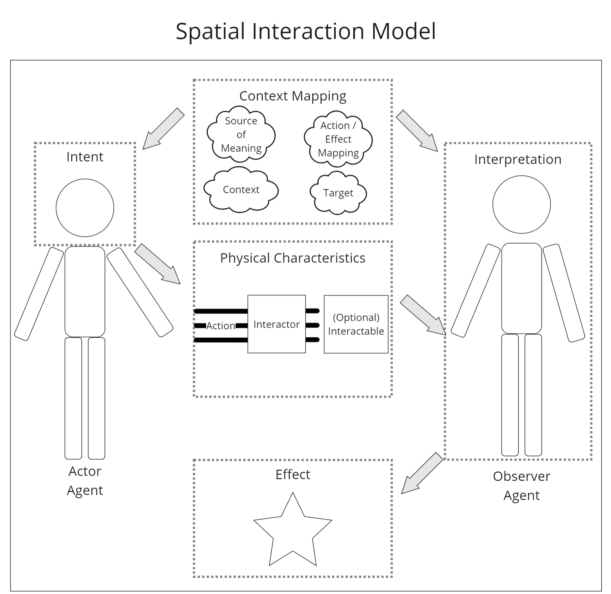

(Work in Progress as I finish the webpage...)

# Foreword

[Screenshot Source](https://x.com/phil_lol_ogist/status/1570848907890139139?lang=en)

As I was writing my dissertation and trying to put my work together, I realized that I have suffered massive scope creep. I should have just conducted a (good) user study on Virtual Equipment System and wrap it up.

Instead, my curiosity and desire for perfection led me to add a multi-dimensional gesture taxonomy, a spatial interaction model, and the three classes of design lenses to the mix. 

# Introduction

# Abstract
Arthur C. Clarke’s Third Law states, “Any sufficiently advanced technology is indistinguishable from magic.’’ With Extended Reality (XR), we move ever closer to magic-like interactions. However, the current state of the art continues to be dominated by previous computing paradigms, which do not take full advantage of XR’s unique properties. Techniques such as three-dimensional user interfaces and Natural User Interfaces allow for intuitive XR interactions. Still, they can inconvenience users with their strict adherence to real-world rules for naturalness.

Hyperphysical User Interfaces, which do not follow the rules of real-world physics, have been used to address these limitations. This allows the creation of novel and efficient interaction techniques across many more contexts. However, there is no systematic approach to creating hyperphysical interactions. Furthermore, users lack a clear way to access, manage, or customize their repository of techniques.

This thesis presents a systematic and practical approach to the design and development of user interfaces and user interactions in XR that feels like Clarke’s magic. The theory portion presents a model for spatial interaction, three design lenses (Hyperphysical User Interface, Whole-body Interaction, and Extradimensional Space) that apply to the model, and a gesture taxonomy that serves as a road map for gesture design. A series of exploratory prototypes (School of Spatial Sorcery, Virtual Equipment System, and Extradimensional Space Storage) demonstrate the theory’s practical applications. Together, the theory and prototypes guide the design of novel hyperphysical interfaces for any scenario and techniques to access the best tools for those scenarios.

# Content
[Slides](../files/publications/phd/defense%20slides.pdf)

[Dissertation](../files/publications/phd/dissertation.pdf)